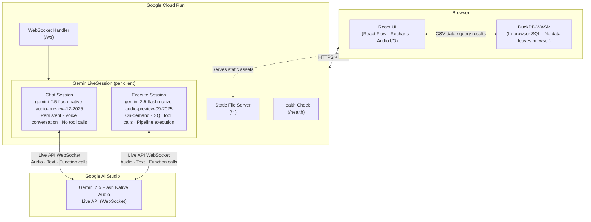

# Gemini Live Agent Challenge — Submission

## Elevator Pitch

Talk to your data. Gemini builds the pipeline.

---

## About the Project

### Inspiration

Data wrangling tools have always been built around text — type a formula, write a query, fill a form. Even modern AI tools default to a chat box. The Gemini Live API opened a different door: what if you could just *talk* to your data the way you'd talk to a colleague? "Join these two tables on customer ID." "Filter to only active users." "Show me a bar chart of sales by region." That framing — voice as the primary interface, with a visual pipeline as the live output — was the core inspiration.

### How It Was Built

The app pairs a **Node.js/Fastify backend** on Google Cloud Run with a **React frontend** running entirely in the browser. The backend maintains two Gemini Live API sessions per user:

- A **persistent chat session** (`gemini-2.5-flash-native-audio-preview-12-2025`) for all voice conversation — superior audio quality, no tool calls.
- An **on-demand execute session** (`gemini-2.5-flash-native-audio-preview-09-2025`) spun up when the user clicks "Execute Canvas" — handles all SQL tool calls and pipeline execution.

All SQL runs in **DuckDB-WASM** inside the browser. No CSV data ever leaves the client. The visual pipeline editor is built on **React Flow**, updating in real time as Gemini emits tool calls. Audio is streamed as raw PCM over WebSocket in both directions.

### Challenges

**The 1008 tool-calling bug.** `gemini-2.5-flash-native-audio-preview-12-2025` disconnects with close code 1008 the moment it attempts a function call. Debugging this took significant time — the solution was a dual-session architecture: keep the superior audio model for conversation only, and route all tool calls through `09-2025`.

**Audio suppression on interrupt.** A time-based suppress window (`Date.now() + 1000ms`) wasn't enough — Gemini's stream doesn't stop instantly. Switching to `Infinity` and only clearing suppression when the server confirms the model stopped (`interrupted` event) solved the overlap.

**Pause/resume audio overlap.** Resetting `nextStartRef` to 0 on resume caused pre-pause audio chunks (still queued in AudioContext) to overlap with new chunks. The fix: keep `nextStartRef` intact so new chunks schedule *after* existing audio finishes.

**Column name hallucination.** SQL agents routinely invent column names like `date` or `name` that don't exist in the actual schema. Three defenses were layered: exact schema injection per turn, strict `EXACT COLUMN NAMES` rules in the system instruction, and SQL error recovery using DuckDB's "Candidate bindings" error messages to self-correct.

**Deferred tool results.** Tools like `executeDataTransform` need to execute in DuckDB-WASM in the browser and return real row counts and schema — the server can't do this. The solution: server forwards the action to the frontend, frontend executes and sends back the result, server relays it to Gemini as a `tool_result`. Gemini resumes only after the real result arrives.

### What Was Learned

The Gemini Live API + function calling combination is genuinely powerful for agentic UX — the model reasons about schemas, emits tool calls mid-conversation, and narrates what it's doing, making the voice-to-action loop feel instantaneous. The biggest lesson: production-quality audio UX requires thinking in terms of streams and events, not request/response cycles. Interrupt, pause, and resume are not UI polish — they're core to making a voice agent feel responsive rather than robotic.

---

## 1. Text Description

### What it does

Gemini Data Wrangler Live is a voice-driven data wrangling tool. Users talk to a Gemini AI agent to explore, join, filter, group, sort, and visualize CSV data through a visual pipeline editor — no code, no text box required.

Upload CSVs, speak naturally ("join these two tables on customer_id", "filter by active status", "show me a bar chart"), and watch the pipeline build itself in real time. The agent understands your data schemas, writes SQL behind the scenes, and updates the UI instantly.

**Execute Canvas mode** extends this further: click "Execute Canvas" and Gemini analyzes the entire pipeline, identifies any incomplete stages, fills them in automatically, narrates what it's doing, and remains available for follow-up questions — all within the same 09-2025 session so the model never switches mid-conversation.

### Features

- **Real-time voice interaction** — Bidirectional audio via Gemini 2.5 Flash Native Audio (Live API). You speak, Gemini speaks back and acts simultaneously.
- **Execute Canvas mode** — One-click pipeline execution. Gemini receives the full graph state, announces the loaded tables and what it's about to do, executes each incomplete stage in dependency order with SQL, narrates results after each step, and announces completion. Follow-up voice questions stay on the same execute session.
- **Dynamic execution status** — While Gemini warms up, the transcript shows "Analyzing pipeline..." instead of a blank spinner. The status line updates as stages complete ("Completed join. Working on filter...").
- **Visual pipeline editor** — React Flow graph that auto-builds as transformations are applied. Stage nodes are color-coded by type (LOAD, JOIN, FILTER, GROUP, SELECT, SORT, UNION). Gradient edges show data lineage. Double-click any node to reconfigure.
- **In-browser SQL engine** — DuckDB-WASM runs all queries locally. No data ever leaves the browser.
- **Schema-aware agent** — Table schemas are injected into Gemini on connect and after each upload. Strict column-name rules in the system instruction and execute prompt prevent hallucination (e.g., inventing "date" when the actual column is "order_date"). SQL error recovery uses DuckDB's "Candidate bindings" error messages to self-correct and retry.
- **Pause / Resume** — Pause Gemini's audio mid-response without interrupting the session. The transcript freezes in sync (buffered text flushes on resume). Pre-pause audio finishes before new audio queues — no overlap.
- **Interrupt** — Stop Gemini's current response with one click. Audio and text both suppress immediately. Suppression is indefinite (not time-based) and lifts only when the server confirms the model stopped, so the next response plays cleanly.
- **Undo transformations** — Ask Gemini to remove a transformation; it confirms verbally, then drops the table and removes the pipeline node.
- **Chart rendering** — Ask for bar, line, or pie charts; Recharts renders them inline from the active table data.
- **Unified chat log** — Full conversation transcript (user + Gemini) with collapsible "thinking" sections showing Gemini's reasoning.
- **Multi-table support** — Tab bar for switching between all loaded CSV tables and computed result tables.

### Technologies

| Layer | Technology |
|---|---|
| AI (chat session) | Gemini 2.5 Flash Native Audio `gemini-2.5-flash-native-audio-preview-12-2025` |
| AI (execute session) | Gemini 2.5 Flash Native Audio `gemini-2.5-flash-native-audio-preview-09-2025` |
| SDK | Google GenAI SDK (`@google/genai`) — Live API with function calling |
| Cloud | Google Cloud Run (backend hosting, WebSocket support) |
| Backend | Node.js + Fastify + `@fastify/websocket` |
| Frontend | React 19 + Vite + TypeScript |
| Flow Editor | @xyflow/react (React Flow) |
| SQL Engine | DuckDB-WASM (runs entirely in the browser) |
| Charts | Recharts |

### Findings and Learnings

**Gemini Live API + function calling is powerful for agentic UX.** The model can reason about table schemas and emit tool calls mid-conversation, making the voice-to-action loop feel instantaneous. The system instruction and per-turn context injection together shape reliable behavior for a niche domain (data wrangling).

**Dual-model architecture solves the audio quality vs. tool-calling dilemma.** `12-2025` has superior audio but a known 1008 regression that disconnects the session the moment it tries to return a tool call. `09-2025` doesn't have this bug. Running them as two separate Live sessions from the same server class — one persistent (chat), one on-demand (execute) — gives the best of both models without user-visible switching.

**Execute session routing must follow the user's voice.** When the execute session is active, `sendRealtimeInput` must target it (not the chat session). `inputAudioTranscription: {}` must also be set on the execute session config — it's easy to omit from an on-demand session that was originally text-only, causing user speech to be processed but never transcribed.

**Audio suppression on interrupt requires `Infinity`, not a timer.** Setting `suppressUntilRef = Date.now() + 1000` lets Gemini's stream resume after 1 second — the model doesn't actually stop instantly. Setting it to `Infinity` and only clearing it when the server sends a confirmed `interrupted` event ensures complete silence until the next response is intentional.

**Pause/resume audio overlap.** Resetting `nextStartRef` to 0 on resume causes pre-pause audio chunks (still queued in the AudioContext) to overlap with new chunks. Keeping `nextStartRef` intact so new chunks schedule after existing audio fixes this.

**React state vs. synchronous refs for pause timing.** Updating `audioPaused` via `useEffect` (async) means `onText` can still buffer chunks briefly after resume. Using a plain `useRef` updated synchronously in the handler eliminates the race.

**Column name hallucination** is a real problem for SQL-generating agents. "date", "name", "region" are common guesses that don't exist in typical schemas. Combining three defenses works: (1) inject the exact schema into every `[DATA CONTEXT]` message, (2) add an "EXACT COLUMN NAMES" rule to the system instruction and execute prompt, (3) add an "SQL ERROR RECOVERY" rule instructing Gemini to use DuckDB's "Candidate bindings" suggestions when a column-not-found error occurs.

**Deferred tool results** are essential for tools that need UI-side execution (executeDataTransform, removeTransform). The server sends the action to the frontend, the frontend executes in DuckDB-WASM, and sends the result back via `tool_result`. Gemini resumes its response only after the real result arrives.

**DuckDB-WASM BigInt serialization** — JavaScript's `JSON.stringify` can't handle BigInt. Coercing to `Number` in the result parser solved it cleanly.

**Node timing in React Flow** — calling `connectNode` right after `addNode` fails because React hasn't re-rendered yet. A short `setTimeout` (80ms) lets the new node appear in `nodesRef` before wiring edges.

**Stage type detection from SQL** requires care — naive `includes("JOIN")` matches table names like `customer_orders_join`. Stripping quoted identifiers and using word-boundary regex (`/\bJOIN\b/i`) fixes this.

---

## 2. Public Code Repository

**URL:** `https://github.com/TLiu2014/gemini-data-wrangler-live`

Spin-up instructions are in the README. Summary:

```bash
git clone https://github.com/TLiu2014/gemini-data-wrangler-live.git
cd gemini-data-wrangler-live
cp .env.example .env        # add your GOOGLE_API_KEY
npm install
npm start                    # opens at http://localhost:5173
```

---

## 3. Proof of Google Cloud Deployment

### What to record

Make a short screen recording (30–60 seconds) showing the backend running on Google Cloud Run. Walk through these pages:

#### Step 1: Cloud Run service dashboard

1. Open [Google Cloud Console](https://console.cloud.google.com)
2. Navigate to **Cloud Run** (hamburger menu > Cloud Run, or search "Cloud Run")
3. Click the **gemini-data-wrangler-live** service
4. Show the **Service details** page — it displays:
   - Service URL (`https://gemini-data-wrangler-live-xxxxxxxxxx-uc.a.run.app`)
   - Region (e.g. `us-central1`)
   - Last deployed revision and status (green check = healthy)

#### Step 2: Revision details

1. Click the **Revisions** tab
2. Click the latest revision
3. Show:
   - Container image (built from our Dockerfile)
   - Port: `8080`
   - Environment variables: `GOOGLE_API_KEY` is set

#### Step 3: Logs (proof it's running)

1. Click the **Logs** tab (or go to Cloud Logging)
2. Show recent log entries — you should see:
   - `Backend listening on http://0.0.0.0:8080`
   - `Gemini Live session opened`
   - HTTP request logs for `/health`, `/ws`, and static file serving

#### Step 4: Live app

1. Open the service URL in a new browser tab
2. Show the app loads and is functional (upload a CSV, toggle mic, talk to Gemini)
3. Point out the URL bar showing `*.run.app` — confirming it's hosted on Cloud Run

### How to host the proof video

Drag & drop the video into the GitHub README web editor — GitHub uploads it to its CDN and inserts a permanent URL. The video is **not committed to the repo**.

1. Record the screen recording (30–60 sec, MP4)
2. Go to your README on github.com → click the pencil (Edit) icon
3. Drag the `.mp4` file into the editor — GitHub uploads it and inserts a `https://github.com/user-attachments/...` URL
4. Commit the README change
5. Paste that CDN URL into the Devpost "URL to Proof" field

### How to deploy (if not yet deployed)

See [DEPLOY.md](./DEPLOY.md) for full instructions.

---

## 4. Architecture Diagram



### Flow

1. **User uploads CSV** → parsed by DuckDB-WASM in the browser; schema sent to server via WebSocket
2. **User speaks** → PCM audio streamed to server → forwarded to Gemini Live API
3. **Gemini responds** → audio streamed back → played in browser; tool calls intercepted by server
4. **Tool call (executeDataTransform)** → server sends SQL to browser → DuckDB-WASM executes → result returned to server → forwarded to Gemini as tool result
5. **Execute Canvas** → full pipeline graph sent to execute session (09-2025) → Gemini fills incomplete stages, narrates results, stays live for follow-up voice

---

### ASCII fallback

```
┌─────────────────────────────────────────────────────────────┐
│                     Google Cloud Run                         │
│                                                             │
│  ┌─────────────────────────────────────────────────────┐    │
│  │               Node.js / Fastify Server               │    │
│  │                                                     │    │
│  │  ┌──────────┐  ┌──────────────┐  ┌──────────────┐  │    │
│  │  │ /ws      │  │ /health      │  │ /*           │  │    │
│  │  │ WebSocket│  │ Health check │  │ Static UI    │  │    │
│  │  └────┬─────┘  └──────────────┘  └──────────────┘  │    │
│  │       │                                             │    │
│  │       │         GeminiLiveSession                   │    │
│  │       │  ┌──────────────────────────────────────┐   │    │
│  │       └──│  Chat session (12-2025)               │   │    │
│  │          │  • Persistent, always on              │   │    │
│  │          │  • Voice conversation, no tool calls  │   │    │
│  │          │                                       │   │    │
│  │          │  Execute session (09-2025) [on-demand]│   │    │
│  │          │  • Created on "Execute Canvas" click  │   │    │
│  │          │  • Handles all SQL tool calls         │   │    │
│  │          │  • Receives user audio for follow-ups │   │    │
│  │          │  • Lives until next execute or discon.│   │    │
│  │          └──────────────────┬───────────────────┘   │    │
│  └─────────────────────────────┼───────────────────────┘    │
│                                │                             │
└────────────────────────────────┼─────────────────────────────┘
                                 │
                                 ▼
                    ┌────────────────────────┐
                    │   Google AI Studio     │
                    │   Gemini 2.5 Flash     │
                    │   Native Audio Models  │
                    └────────────────────────┘

             ▲ HTTPS + WSS
             │
┌────────────┴──────────────────────────────────────────┐
│                       Browser                          │
│                                                        │
│  ┌──────────────────┐  ┌───────────────────────────┐  │
│  │  React UI        │  │  DuckDB-WASM              │  │
│  │  • React Flow    │  │  • In-browser SQL engine  │  │
│  │  • Recharts      │  │  • CSV import / query     │  │
│  │  • Audio I/O     │  │  • No data leaves browser │  │
│  │  • Pause/Resume  │  └───────────────────────────┘  │
│  │  • Interrupt     │                                  │
│  └──────────────────┘                                  │
│                                                        │
│  Voice ←→ WebSocket ←→ Gemini Live API                 │
└────────────────────────────────────────────────────────┘
```

---

## 5. Demo Video

_(Recorded separately — not included in this document.)_
